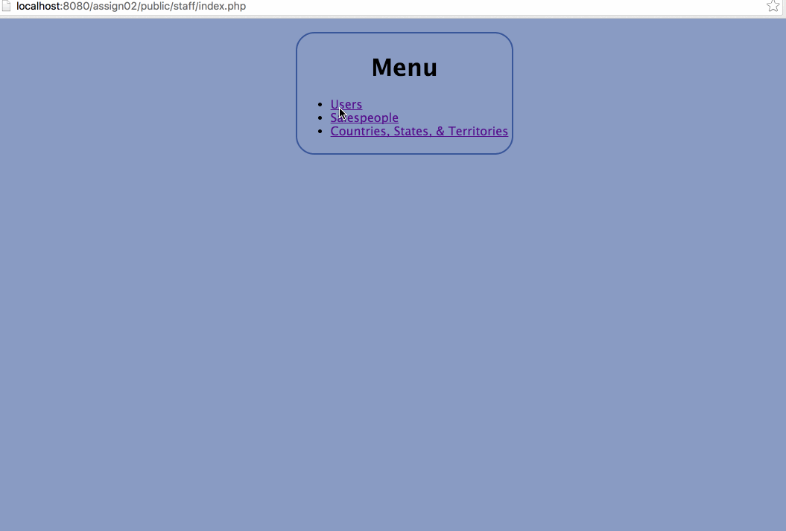

# Project 2 - Globitek Input/Output Sanitization

Time spent: **8** hours spent in total

## User Stories

The following **required** functionality is completed:

**(all required stories completed)**

- [x] Import the Starting Database
- [x] Set Up the Starting Code
- [x] Staff CMS for Users
- [x] Staff CMS for Salespeople
- [x] Staff CMS for States
- [x] Staff CMS for Territories
- [x] Validations
- [x] Sanitization
- [x] Penetration Testing
  - [x] (list of vulnerabilities in Notes section)

The following advanced user stories are optional:

**(all optional stories completed)**

- [x] Bonus: On "public/staff/territories/show.php", instead of displaying an integer value for territories.state_id, display the name of the state.
- [x] Bonus: Validate the uniqueness of users.username, both when a user is created and when a user is updated
- [x] Bonus: Add a page for "public/staff/users/delete.php". Add a link to it from the user details page. The delete page will display the text: "Are you sure you want to permanently delete the user: ". If the user confirms it, delete the user record and redirect back to the users list.
- [x] Bonus: Add a Staff CMS for countries. (Creating a countries table was a bonus objective in last week's assignment.) Add pages for "list", "show", "new", and "edit", similar to the pages in the CMS area for states.
- [x] Advanced: Nest the CMS for states inside of the Staff CMS for countries (created in the previous challenge). It should be nested in the same way in which territories are nested inside of states.

## Video Walkthrough

Here's a walkthrough of implemented user stories:

GIF created with [LiceCap](http://www.cockos.com/licecap/).

## Notes

* I made the decision to, upon catching a validation error when submitting any edit.php, display the original values in the form rather than the invalid ones. E.g. If you try to rename a country Germany$, the resulting page will read "Edit Country: Germany" rather than "Edit Country: Germany$".

Penetration Testing:
- Before adding in any sanitization, every input field is vulnerable to XSS and SQL injection attacks. This includes both reflected and stored types of XSS.
* An example of the reflected XSS comes from putting  into one of the input fields, which will then cause that information to be echoed back into the form for resubmission.
* An example of the stored XSS could come by putting the same script tag as above into a form submission, and ensuring that the form submitted without error. Since that information is now stored in the sql database, it will be output when any user goes to the "show.php" page for that record
* An example of SQL injection (before implementing prepared statements) would be editing the username of a user to test_u'; -- , which would have the effect of changing every user in the database to have all the same values (first_name, last_name, etc.) by commenting out the WHERE id= clause.
* In addition, one action that could be considered a security vulnerability is that by increasing the "id" parameter on the show.php page for users, the exact number of users can be discovered by increasing the number until an invalid page is returned. In a commercial system, this could have undesired consequences, which could be solved by randomizing user ID numbers.

## License

    Copyright [2016] [David Maydew]

    Licensed under the Apache License, Version 2.0 (the "License");
    you may not use this file except in compliance with the License.
    You may obtain a copy of the License at

        http://www.apache.org/licenses/LICENSE-2.0

    Unless required by applicable law or agreed to in writing, software
    distributed under the License is distributed on an "AS IS" BASIS,
    WITHOUT WARRANTIES OR CONDITIONS OF ANY KIND, either express or implied.
    See the License for the specific language governing permissions and
    limitations under the License.
